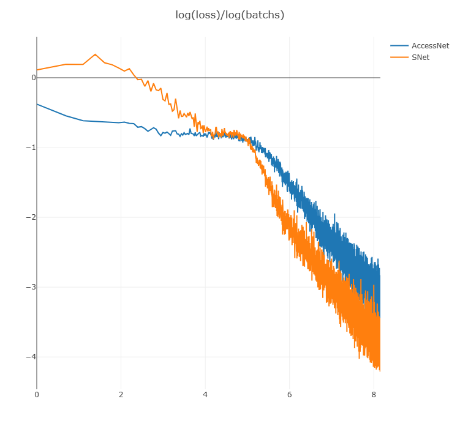

# SNet
A specially designed architecture for efficient training of ultra-deep neural networks without normalization and skip connections

## 核心思路
构建正数第n层与倒数第n层为初始状态下的互逆对. 通过互逆对嵌套, 保证梯度稳定传输到最上层.
目前给出的SLU单元每层可替代一个Linear层和与其串联的激活函数.

## Demo程序
demo程序在test.py文件中,提供了100层的下面两种网络的对比训练
AccessNet在每层的输出使用了直达输出层的跳跃连接
SNet没有使用跳跃连接的简单网络,使用了特制的初始化实现了初始状态下对应层的互逆.
两者都没有使用通常意义上的归一化层
demo程序中使用[Atiny优化器](https://github.com/PsycheHalo/Atiny), 也可根据习惯自行换用其他优化器
直接运行即可得到此页面中的对比图.(依赖visdom)
demo中简陋的使用神经网络对一个包含动态随机参数的公式生成的周期性曲线进行预测.
